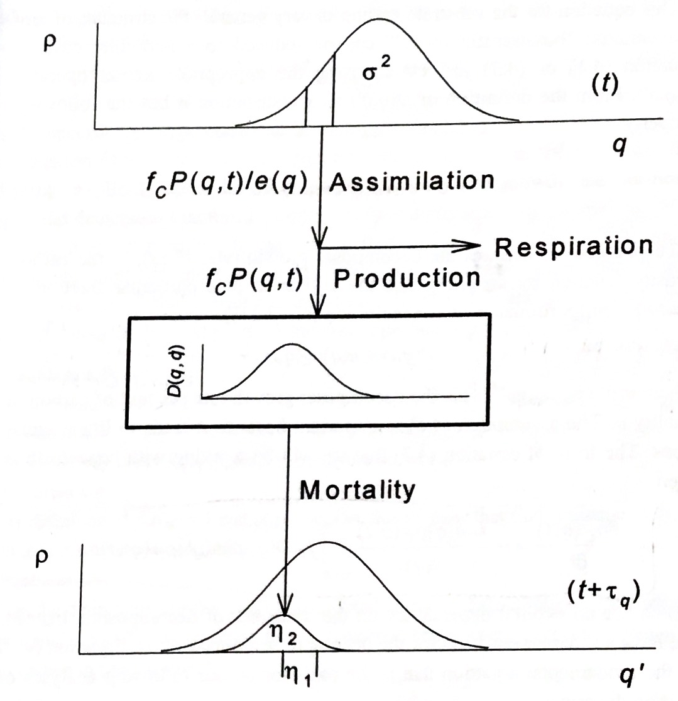

# Q-model (Ågren & Bosatta)

---

## 1. What the model does 

, adapted from (Bosatta, E., & Ågren, G. I. (1999). Soil organic matter quality interpreted thermodynamically. Soil Biology and Biochemistry, 31(13), 1889-1891.)


The Q-model simulates soil organic matter decomposition using the idea of **substrate “quality”** `q`
- Fresh input enters the system (litter / organic input)
- Microbial processing decreases quality over time
- Lower `q` usually means slower decomposition

The code provides two main scenarios:
- **Forest** (`forest_run`): carbon **and** nitrogen time series (C and N)
- **Bare fallow / steppe** (`barefallow_run`): carbon time series (and optional plant-derived fraction), with a climate multiplier `Re`

---

## 2. Repository layout

- `qmodel/forest.py` — forest scenario functions
- `qmodel/barefallow.py` — barefallow scenario functions
- `qmodel/climate.py` — helper functions for `Re` (constant, random, etc.)
- `examples/` — small runnable examples
- `MANUAL.md` / `MANUAL_EN.md` — documentation

---

## 3. Install & quick start 

Clone the repository and make sure Python ≥ 3.9 is available.

```bash
git clone https://github.com/yourname/qmodel.git
cd qmodel
```
---

## 3.1. Command-line interface (CLI)

The model can be run directly from the command line.

### Basic syntax

```bash
python -m qmodel.cli <model> --params <file> [options]
```

### 3.2. Import from a local folder
If you extracted the project into a folder (for example `qmodel_project/`), add it to Python path:

```python
import sys
sys.path.insert(0, "qmodel_project")
```

### 3.3. Quick run: Forest
```python
from qmodel.forest import ForestParams, forest_run

p = ForestParams(
    l=5.0,     # litter input
    q0=1.0,    # initial quality
    r0=60.0,   # N/C ratio (see section 4)
    T_C=5.0,   # temperature (°C)
    fC=0.45,   # carbon fraction
    fN=0.08    # nitrogen fraction
)

df = forest_run(p, n_steps=100, dt=1.0)   # 100 steps, dt=1 year
df.head()
```

### 3.4. Quick run: Bare fallow
Constant climate factor `Re`:
```python
from qmodel.barefallow import BareFallowParams, barefallow_run

p = BareFallowParams(Css=100.0, q0=1.0, u0=0.5)
df = barefallow_run(p, n_steps=200, dt=1.0, Re=0.9, variable_Re_mode="analytic")
```

Random `Re` each year (recommended: iterative update):
```python
from qmodel.climate import random_uniform
Re_fun = random_uniform(0.7, 0.98, seed=42)

df = barefallow_run(p, n_steps=200, dt=1.0, Re=Re_fun, variable_Re_mode="iterative")
```

---

## 4. Inputs 
**Time control:**
- `n_steps` — number of time steps
- `dt` — length of one step (default idea: **1 step = 1 year**, but it can be any unit)

**Forest inputs:**
- `l` — organic input (litter / inflow)
- `q0` — initial substrate quality
- `r0` — N/C ratio or C/N(-1)
- `T_C` — temperature in °C (used to compute `u0` in forest scenario)
- `fC`, `fN` — fractions for carbon / nitrogen

**Bare fallow inputs:**
- `Css` — a scaling / reference carbon level used in the barefallow script logic
- `u0` — base decomposition rate
- `Re` — climate multiplier (temperature * moisture, etc.)

---

## 5. Outputs 
Both runs return a **pandas DataFrame** with at least:
- `t` — time (0, dt, 2dt, …)
- `q` — quality over time
- `C` — carbon stock (or scaled carbon)
Forest also returns:
- `N` — nitrogen stock

---

## 6. Data input & output (files)

You can **load inputs “as a document”** (CSV/Excel/JSON)

### 6.1. Recommended project folders
- `params/` — input tables (CSV or Excel)
- `out/` — results (CSV/Excel/PNG)

### 6.2. Input formats

#### Option A — CSV (.csv)
Example `params/params_forest.csv`:
```csv
scenario,l,q0,r0,T_C,fC,fN,n_steps,dt
forest_site1,5.0,1.0,60,5,0.45,0.08,100,1.0
forest_site2,4.2,1.1,55,7,0.44,0.09,200,1.0
```

Load + run:
```python
import pandas as pd
from qmodel.forest import ForestParams, forest_run

params = pd.read_csv("params/params_forest.csv")

all_out = []
for _, row in params.iterrows():
    p = ForestParams(l=row.l, q0=row.q0, r0=row.r0, T_C=row.T_C, fC=row.fC, fN=row.fN)
    df = forest_run(p, n_steps=int(row.n_steps), dt=float(row.dt))
    df["scenario"] = row.scenario
    all_out.append(df)

result = pd.concat(all_out, ignore_index=True)
```

#### Option B — Excel (.xlsx)
Use a sheet called `forest` with the same columns as CSV:
```python
params = pd.read_excel("params/params.xlsx", sheet_name="forest")
```

#### Option C — JSON (.json)
Example `params/config_forest.json`:
```json
{
  "model": "forest",
  "n_steps": 100,
  "dt": 1.0,
  "params": {"l": 5.0, "q0": 1.0, "r0": 60, "T_C": 5, "fC": 0.45, "fN": 0.08}
}
```

```python
import json
from qmodel.forest import ForestParams, forest_run

cfg = json.load(open("params/config_forest.json", "r", encoding="utf-8"))
p = ForestParams(**cfg["params"])
df = forest_run(p, n_steps=cfg["n_steps"], dt=cfg["dt"])
```

### 6.3. Saving results

#### CSV
```python
result.to_csv("out/qmodel_results.csv", index=False)
```

#### Excel (time series + summary)
```python
import pandas as pd

with pd.ExcelWriter("out/qmodel_results.xlsx") as w:
    result.to_excel(w, sheet_name="timeseries", index=False)
    summary = (result.groupby("scenario")
                     .agg(C_final=("C", "last"), q_final=("q", "last"))
                     .reset_index())
    summary.to_excel(w, sheet_name="summary", index=False)
```

#### Parquet 
```python
result.to_parquet("out/qmodel_results.parquet", index=False)
```

#### PNG plots
```python
import matplotlib.pyplot as plt

for name, df_s in result.groupby("scenario"):
    plt.figure()
    plt.plot(df_s["t"], df_s["C"], label="C")
    if "N" in df_s.columns:
        plt.plot(df_s["t"], df_s["N"], label="N")
    plt.legend()
    plt.xlabel("t")
    plt.savefig(f"out/plot_{name}.png", dpi=200, bbox_inches="tight")
    plt.close()
```

---

## Appendix A. How to use the Excel file QLUSTRA-E
(Original model logic without the temperature–moisture module implemented as an .xlsx)

1) Open the file and locate the Example sheet.
2) Enter your parameter values.
3) Check the “Calculations” sheet: it shows the internal steps.
4) Compare outputs to your Python run (same parameters and same time step).

---

## Appendix B. Variable mapping (old scripts → refactored code)
See the Russian manual (`MANUAL.md`) if you need a detailed mapping table.
